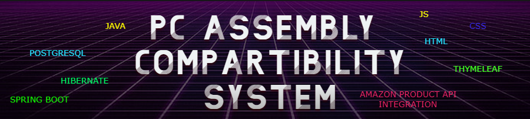
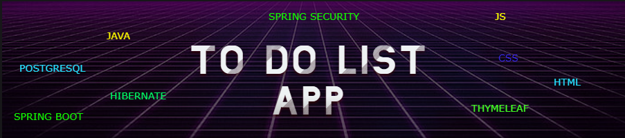

# Portfolio

</img>

My portfolio includes projects for position of java junior developer.

Alfred Nobel Univercity graduation project - PC assumbling system 
- calculates pc parts compartibilities and coasts.
- Integrate Amazon PA API to get actual prices from Amazon.
   
</img>

Backend:

#</img>  Java: [Core programming language for server-side logic and business logic implementation.]
#</img>  Spring Boot:[building RESTful APIs and managing application components.]
</img> Hibernate: Acts as the ORM (Object-Relational Mapping) tool, facilitating communication between Java objects and the PostgreSQL database.
</img> PostgreSQL: Reliable relational database management system for storing and managing data persistently(components,price history,user data).
</img> Rest API: Enables seamless communication between the frontend and backend, facilitating data exchange and processing.(Amazon PA API)
  
  
Frontend:

- HTML: Structures the user interface and defines the content and layout of web pages.
- Thymeleaf: Dynamically renders HTML templates, integrating with Spring Boot for server-side rendering.
- CSS: Styles the web pages, controlling the visual appearance and layout of the frontend.
- JavaScript: Adds interactivity and dynamic behavior to the user interface, allowing real-time updates and asynchronous communication with the backend.
  
[Source_code](https://github.com/Javac-g/Computer_Build_System)

Softserve academy - Java Online Marathon graduation project - To do list application

</img>
- create user(authentication)
- create to do list
- add coloborators(authentication)
- add item
- set item priority
- change item
- delete item
- admin panel

[Source_code](https://github.com/Javac-g/ToDoListApplication)

